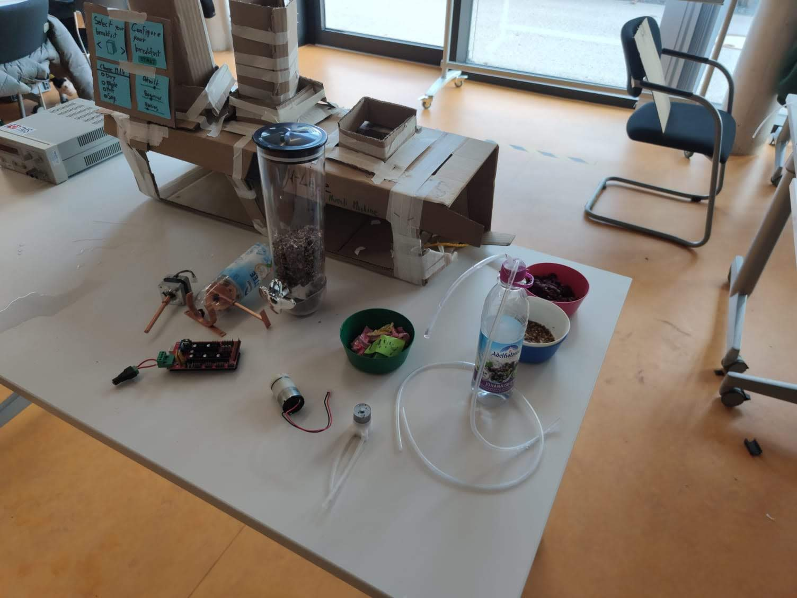
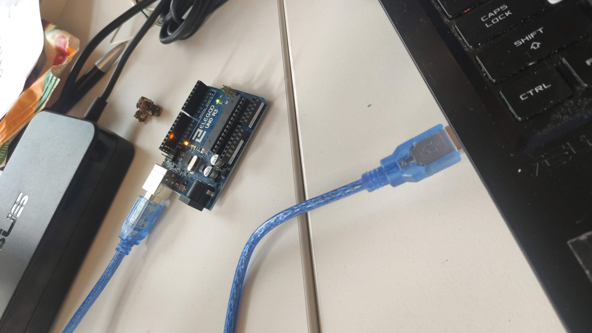
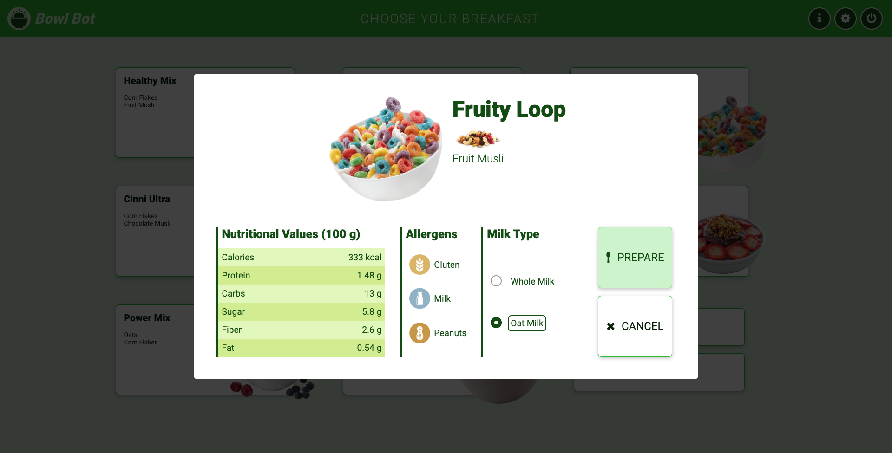
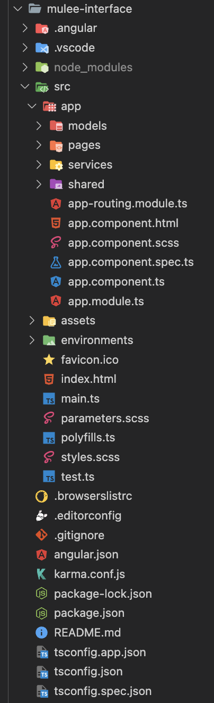

<!-- Banner -->

  
  

 
 
 

# General Presentation

This project was realised during the [Think.Make.Start](https://www.tms.tum.de/) course at [Technical University of Munich](https://www.tum.de/en/), during my 3rd semester of study. It was a very practically oriented course, in which teams of 4-6 people from different backgrounds were formed, in order to work together and realize a MVP (Minimal Viable Product), based on priorly executed user research, as well as create a business plan accordingly.

For this class, our team [Good Enough](#happy-mornings-co-team-goodenough) created the [Happy Mornings](#happy-mornings-co-team-goodenough) brand, and [μ-Lee](#μ-lee-the-muesli-machine-hardware) for the MVP (also called Bowl Bot): a musli maker machine, that lets you create your ideal bowl of musli, by either choosing from recipe presets, or by customising your own recipe, based on given ingredients and liquid types (i.e. whole milk, soy milk, yogurt).

> For a more visual representation you can watch:
>
>> [⭐️ Happy Mornings - Final Presentation](https://youtu.be/R5Rs-sDh5Es?t=3587)
> 
>> [💰 μ-Lee - Marketing Video](https://www.youtube.com/watch?v=6v9q5W7iz9I&ab_channel=Think.Make.Start.)
> 
> [🎥 μ-Lee - Demo Video 1](https://1drv.ms/v/s!AhuGQNYSUMIE0MlBKUG_KAz4Puc5pw?e=vdppKy)
> 
> [🎥 μ-Lee - Demo Video 2](https://1drv.ms/v/s!AhuGQNYSUMIE0Mg5wSTdzRWxywP5pg?e=pb6BAL)

## μ-Lee: The Muesli Machine (Hardware)

|||
|:-:|:-:|
|Front|Back|

The final hardware product of our project consisted of the following components:
1. **Arduino Board**, responsible for controlling all the other mechanical components, by running the Arduino custom logic written in C (see [Embedded (Arduino)](#embedded-arduino)) . For tests we mainly used an Arduino Uno board. As for the final MVP, we used an Arduino Mega 2560.
2. **Case**, including all the casing components, like: wood plates, metal frameworks, etc. The case was also branded using laser cutting technology.
3. **Conveyor Belt**, which includes the actual belt, the metallic support framework, the plate for the bowl, and 2 proximity sensors, used for detecting when the bowl plate reached either one of the two ends.
4. **Motors & Dispensers**, used for dispensing the solids (like musli, fruits, etc.). We adapted some manual dispensers, by adding servo-motors to the dispensing wheel.
5. **Air Pumps & Tubes**, used for dispensing the liquids (like milk, yogurt, etc.).
6. **Touchscreen Monitor,** although we bought a touchscreen monitor, we ended up by just using one of our laptops, which also had touchscreen.
7. **Other Components,** like (stepper) cables,  bowls, cereals, etc.

 

  
  
  Some of the used components

 

|  |  |  |  |  |
|:-:|:-:|:-:|:-:|:-:|
| Adjusting the manual dispensing mechanism | Bowl plate (empty) | Solids dispensing (ignore the cups) | Liquids dispensing | Testing serial port communication  (Arduino Uno) |

The final product was realised with the help of [MakersSpace workshop](https://maker-space.de/), by mainly using the following technologies:
- laser cutting
- 3D printing
- other tools

## User Interface

The User Interface is realised using an Angular WebApp, with 3 main views:
- **Predefined view**, for displaying all the available predefined recipes.
- **Details view**, for displaying details about the selected recipe (e.g. nutritional values, allergens, choosing your preferred liquid, etc.).
- **Customise view**, for creating a custom recipe.

|||
|:-:|:-:|
|||

## TMS (Think.Make.Start) Batch #15

TMS is a 2-week (full-time) class in which 50 students, coming from different specialisations, backgrounds, and study programs, are assigned to teams and different roles within them, all working towards the common goal of realising an inovative product in the current market. Some of the main aspects of TMS are: interdisciplinary learning, hands-on experience, design thinking methods, pitch training, and a demo-day that takes place in the final day of the class, and concludes the project.

In each team, there are 3 main roles, associated with each one of the students:
1. **Problem Expert:** focuses on understanding of potentials,  
customer needs, challenge assumptions and asking a lot of questions.
2. **Technical Developer:** focuses on prototyping, experiments, making things work and usability testing.
3. **Business Developer:** focuses on sustainable business models, analysing markets, customers and finances and scaleability.

||||
|:-:|:-:|:-:|
||||

## Happy Mornings Co. (Team GoodEnough)

Our team was a pretty unusual one, consisting of 4 members, all having the same role (Technical Developer). But, no matter the circumstances, we managed to bring to life a pretty cool product idea, business plan, user research, and MVP.

**Team Members:**
- **Paul Pasch** ([LinkedIn](https://www.linkedin.com/in/paul-pasch-782b01252/))
- **Robert Feussner** ([LinkedIn](https://www.linkedin.com/in/robert-feussner/))
- **Teodor Mihaescu (Me)** ([LinkedIn](https://www.linkedin.com/in/teodor-mihaescu/))
- **Towsif Zahin Khan** ([LinkedIn](https://www.linkedin.com/in/towsif-zahin-khan-b20896220))

|||
|:-:|:-:|

## From Prototype to Product

During the class, we had numerous occasions to present our work to the coaches, receive feedback, change directions, and evolve on different paths. For our agile development, we followed a custom model, called The [Petra Cycle Model](https://petra-prototyping.de/), with one-day sprints, sustaining daily meetings, and reporting our progress using a custom tool.

Until reaching the MVP, we've gone through different prototyping stages, such as creating digital prototypes, designing cardboard prototypes, working on different component prototypes, etc.

> For a better understanding of the process, you can also watch:
>
> [🎥 μ-Lee - Midterm Presentation](https://www.youtube.com/watch?v=RuNcr3QVcV8&list=PLebJtqFegBw2hf3CUEwumbB12ujIWqJHQ&index=3&t=3082s)

|||
|:-:|:-:|
|||

## Future Improvements

Possible future improvements include (but are not limited to):
- **Hardware:** Making the final product more compact, and feasible to the market. By better organising the cables and components, and adjusting the size of the case.
- **Hardware:** Adding additional sensors, like a scale for the bowl support. Since the quantity of both solids and liquids is currently just measured by the no. of rotations executed by the servo-motors.
- **Software:** Implementing the Explore view, where users can explore different recipe configurations, based on their activities in that day (e.g. fitness mode).
- **Software:** Implementing the Configuration view, used by the customers (e.g. hotel staff) to create custom recipes, or edit current predefined recipes, ingredients, etc. 
- **Feature:** Notifying customers (e.g. hotel staff) when ingredients run out.
- **Market:** Extending the user research, by finding additional markets, and conducting additional user interviews.

# Technical Presentation

This section includes additional technicalities, like an overview on the overall architecture, as well as additional details about the separate projects in the repository.

## Architecture Overview

**Entities:**
- **User:** the user of the machine (e.g. a hotel guest)
- **Machine's Touchscreen:** a touchscreen used to display the user interface, and with which the user interacts directly.
- **Server:** includes the API, used to serve data to the front-end web application (i.e. user interface). The server is also responsible of the communication with the Arduino (board), via serial port communication (in our case we used the Node Serial Port module for this).
- **Data:** the data that is being served to the user interface, through the server's API.
- **Arduino:** the Arduino board used for coordinating the actual mechanical parts involved into the processes.
- **u-Lee Machine:** the actual machine, consisting of all its hardware components involved in realising the processes.
- **Cereals:** the actual bowl of cereals served to the end-user (initially empty).

**Main Process:**
- **Step 0:** User places an empty bowl at the left end of the machine's conveyor belt.
- **Step 1:** User interacts with the UI, choosing their desired commands.
- **Step 2:** UI's web application sends a request to the API of the server.
- **Step 3:** Server receives API request and retrieves required data from the JSON files. Desired data is sent back to the UI (in case of a GET request).
- **Step 4:** In case of a POST request, the server processes the desired recipe, parses it, creates the Arduino-readable commands, and sends it to the Arduino board, through the priorly established serial port communication channel.
- **Step 5:** The Arduino board permanently communicates with the actual components of the machine, coordinating them, and executing the commands received from the server in **Step 4** (For the end-sensors reading "parallel execution" of the conveyor belt, hardware C-like interrupts have been used).
- **Step 6:** The fills the bowl from **Step 0** with the respective ingredients of the desired recipe. 
- **Step 7:** User picks up the bowl, containing their desired recipe.

## Client (Angular)

| Structure | Description |
|:-:|:--|
|  | **📂 models:** entity TypeScript models (ex: recipe, ingredient, etc.) **📂 pages:** Angular components of the actually displayed views/interfaces **📂 services:** Angular services, like the one responsible for the API communication **📂 shared:** shared Angular components, like the modal window, range selector, etc. **📂 assets:** interface necessary assets, like icons for the allergens **📂 environments:** environment specific configurations (like the endpoint of the server) **📄 parameters.scss:** general style parameters, like the color palette |

## Server (ExpressJS)

| Structure | Description |
|:-:|:--|
|  | **📂 config:** contains config files, like CORS configuration **📂 controllers:** contains the used API controllers, responsible for exposing the used endpoints **📂 data:** JSON files, used to persist data (like predefined recipes, available ingredients, allergens, etc.) **📂 routes:** contains routing configuration files, that are redirecting requests to the respective endpoints of the API **📂 services:** services, responsible for the custom logic of the server, like console logging, serial port communication, etc. **📄 server.js:** main point of the server, responsible for initialising the API, and configuring dependencies |

## Embedded (Arduino)

| Structure | Description |
|:-:|:--|
|  | **📄 0_globals.ino:** global constants, variables, parameters, etc. **📄 active_recipe.ino:** functionalities for preparing the active/chosen recipe **📄 conveyor.ino:** conveyor logic, like the hardware interrupts used for checking on conveyor's ends **📄 dispenser_milk.ino:** functionalities for dispensing milk **📄 dispenser_solid.ino:** functionalities for dispensing solids (like musli, fruits, etc.) **📄 dispenser_yogurt.ino:** functionalities for dispensing yogurt **📄 main.ino:** main point of the arduino logic, including initialisations and looping logic **📄 parser.ino:** parser functionalities **📄 stepperfun.ino:** stepper motors functionalities  |

 
 
 

> **© Copyright Notice:** I don't own some of the presented digital media content, like photos taken during the TMS class (batch #15). For further reference see [TMS - Official Website](https://www.tms.tum.de/), as well as [TMS - Instagram Page](https://www.instagram.com/thinkmakestart/).
